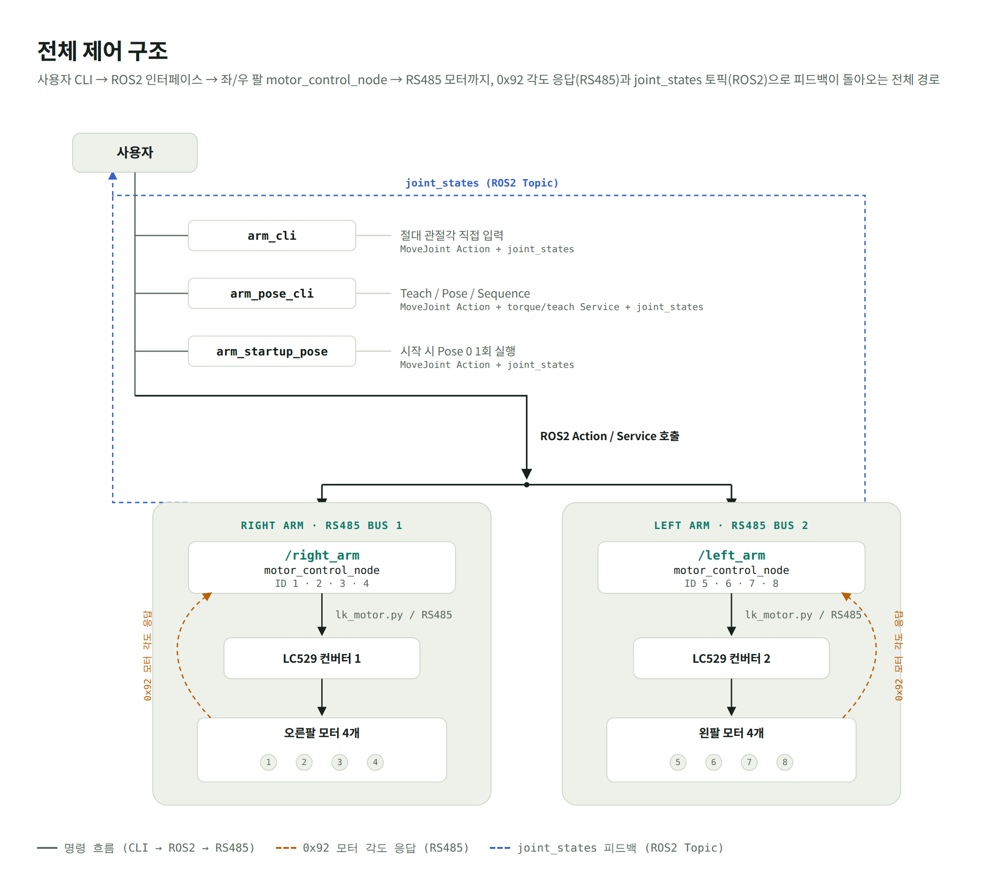

[English](./README.md) | **한국어**

# 8축 양팔 로봇 ROS2 제어

LK-TECH RS485 모터 8개로 구성된 iROI 양팔 로봇의 ROS2 Humble 제어 패키지입니다. 모터 절대각 기준 복원, 현재 위치 HOLD, 절대 관절각 이동, Teach, Pose 저장·재생, Sequence 실행을 제공합니다.

> 개발 상태: ID 1–8의 통신·모델·각도·개별 영점 확인과 4축 Action 이동을 단계적으로 검증했습니다. 두 RS485 버스에 8개 모터를 동시에 연결한 최종 양팔 검증, 회전 방향 최종 보정, 관절 제한 설정은 남아 있습니다.

## 프로젝트 한눈에 보기

| 단계 | 내용 |
|---|---|
| 문제 | 서로 다른 감속비의 RS485 모터 8개를 양팔로 제어하면서, 전원 재인가 후 좌표를 복원하고 중력 처짐 없이 Pose를 재현해야 했습니다. |
| 설계 | 오른팔과 왼팔을 독립 namespace·RS485 bus로 분리하고, 저수준 모터 드라이버 위에 ROS2 Topic·Service·Action과 사용자 CLI를 계층화했습니다. |
| 핵심 구현 | `reference_only`, 현재 위치 HOLD, 절대 관절각 Action, Teach/Pose/Sequence, `null` 기반 부분 Pose, 목표 도착 안정 판정을 구현했습니다. |
| 실물 결과 | ID 1–8의 통신·모델·각도·개별 영점을 확인했고, 혼합 i10/i36 구성과 4축 Action 이동을 단계적으로 검증했습니다. |
| 데모 | 완성된 양팔의 시작·Teach 저장·Pose/Sequence 실행 영상과 사진은 최종 8축 실물 검증 후 추가할 예정입니다. |
| 기술적 의사결정 | 조립 상태에서 자동 영점 이동 대신 기준만 복원하고 HOLD하며, 명령은 상대값이 아닌 절대 출력축 각도로 통일했습니다. 도착은 오차 허용치와 연속 표본으로 판정합니다. |

## 반드시 먼저 읽기

- 실물 테스트 중에는 로봇팔을 사람이 지지하고 비상 전원 차단 수단을 준비하세요.
- 최초 실물 검증 또는 배선·조립·영점·방향 설정 변경 후에는 `start_pose:=false`로 시작하세요. 이 경우 시작 위치를 좌표 기준으로만 복원하고 그 자리에서 HOLD합니다. 검증이 완료된 정상 운용에서는 `start_pose:=true`로 Pose 0 자동 실행을 사용할 수 있습니다.
- Teach ON은 토크를 끕니다. 중력으로 팔이 떨어질 수 있으므로 팔을 잡은 상태에서 실행하세요.
- 한 RS485 포트는 한 프로그램만 사용해야 합니다. `motor_control_node` 실행 중 같은 포트로 `scan_ids`, `probe_motors`, `check_home`을 실행하지 마세요.
- 현재 관절 최소·최대 제한은 아직 설정하지 않았습니다. 작은 각도와 낮은 속도로 먼저 방향과 구조 간섭을 확인하세요.

## 최종 모터 구성

| 팔 | 모터 ID | ROS namespace | Action endpoint | 현재/예상 포트 |
|---|---:|---|---|---|
| 오른팔 | 1, 2, 3, 4 | `/right_arm` | `/right_arm/move_to` | `/dev/ttyUSB0` |
| 왼팔 | 5, 6, 7, 8 | `/left_arm` | `/left_arm/move_to` | `/dev/ttyUSB1` 예상 |

모델과 감속비는 ID 1·2·5·6이 `MG4010E-i10`/10:1, ID 3·4·7·8이 `MG5010E-i36`/36:1입니다. 각 팔은 독립 LC529 USB-RS485 컨버터를 사용합니다.

## 전체 제어 구조



`motor_control_node` 하나가 RS485 bus 하나와 팔 하나를 전담합니다. 상위 CLI는 모터 패킷을 직접 보내지 않고 namespaced ROS2 interface만 사용합니다.

## 하드웨어 구성표


| 구분 | 수량 | 확정된 내용 | 상태 |
|---|---:|---|---|
| 제어 컴퓨터 | 1 | Raspberry Pi 4, ROS2 Humble | 사용 중 |
| USB-RS485 컨버터 | 2 | LC529 2개 보유, 팔별 독립 bus로 설계 | 오른팔 `/dev/ttyUSB0`, 왼팔 `/dev/ttyUSB1` 예상 |
| i10 모터 | 4 | MG4010E-i10, ID 1·2·5·6, ratio 10.0 | 개별 확인 완료 |
| i36 모터 | 4 | MG5010E-i36, ID 3·4·7·8, ratio 36.0 | 개별 확인 완료 |
| 모터 전원 | 미확정 | 실측 모터 전압 약 24 V | 모델·정격·수량·분배 방식 확인 필요 |
| Pose 저장소 | 1 | 실행 사용자 `~/.ros/arm_poses.json` | 사용 중 |

### 상세 배선도 — 추후 추가

전원공급장치와 핀 단위 배선은 아직 확정되지 않았습니다. 전원·RS485·보호회로·커넥터 구성이 정리된 뒤 실제 연결을 기준으로 추가합니다. 확정 전에는 예시 배선을 제작 기준으로 사용하지 않습니다.

두 LC529를 동시에 연결했을 때 `/dev/ttyUSB0`과 `/dev/ttyUSB1`의 할당 순서는 재부팅이나 연결 순서에 따라 바뀔 수 있습니다. 최종 운용 전에는 USB serial 정보 기반의 고정 장치 이름 규칙을 정하는 것이 안전합니다.

## 빠른 시작

### 1. 빌드

Raspberry Pi의 실제 작업 공간은 `~/iroi_ws`입니다.

```bash
cd ~/iroi_ws
source /opt/ros/humble/setup.bash
colcon build --symlink-install
source install/setup.bash
```

새 터미널을 열 때마다 아래 두 줄을 다시 실행합니다.

```bash
cd ~/iroi_ws
source install/setup.bash
```

### 2. 한 팔을 움직이지 않고 안전하게 시작

오른팔(ID 1–4):

```bash
ros2 launch motor_control_pkg single_arm_reference.launch.py \
  arm:=right serial_port:=/dev/ttyUSB0 start_pose:=false
```

왼팔(ID 5–8):

```bash
ros2 launch motor_control_pkg single_arm_reference.launch.py \
  arm:=left serial_port:=/dev/ttyUSB0 start_pose:=false
```

컨버터가 하나뿐이라 팔을 번갈아 연결할 때는 두 명령 모두 실제 연결 포트인 `/dev/ttyUSB0`을 사용해도 됩니다. 이 launch는 모터를 `reference_only`로 동기화한 뒤 현재 위치를 즉시 목표로 보내 HOLD합니다. 영점으로 자동 이동하지 않습니다.

### 3. 시작 상태 확인

다른 터미널에서 오른팔 기준으로 확인합니다.

```bash
cd ~/iroi_ws
source install/setup.bash
ros2 topic echo /right_arm/joint_states --once
ros2 action list
ros2 action info /right_arm/move_to
```

왼팔은 `right_arm`을 `left_arm`으로 바꾸면 됩니다. `joint_states`가 출력되고 Action server가 1개 보여야 제어 준비가 된 것입니다.

### 4. Pose 0까지 자동 실행

안전 실행과 방향 확인, Pose 0 확인이 끝난 뒤에만 사용하세요.

```bash
ros2 launch motor_control_pkg single_arm_reference.launch.py \
  arm:=right serial_port:=/dev/ttyUSB0 start_pose:=true
```

시작 순서는 다음과 같습니다.

```text
모터 연결 → reference_only 좌표 복원 → 현재 위치 HOLD
→ joint_states/Action 준비 → ~/.ros/arm_poses.json의 Pose 0 실행 → READY
```

Pose 0의 활성 모터 값이 전부 `null`이면 움직이지 않고 준비 완료로 처리합니다.

### 5. 양팔 시작

두 컨버터와 8개 모터를 모두 연결한 뒤 실행합니다. 첫 시험은 `start_pose:=false`로 합니다.

```bash
ros2 launch motor_control_pkg dual_arm_reference.launch.py \
  right_port:=/dev/ttyUSB0 left_port:=/dev/ttyUSB1 start_pose:=false
```

Pose 0 자동 실행까지 포함하려면 검증 후 `start_pose:=true`로 바꿉니다.

## 직접 관절각 제어: `arm_cli`

먼저 위 launch 중 하나로 모터 노드를 계속 실행해 둡니다. 새 터미널에서 원하는 모드의 CLI를 엽니다.

```bash
# 오른팔: ID 1,2,3,4
ros2 run motor_control_pkg arm_cli --ros-args -p mode:=right

# 왼팔: ID 5,6,7,8
ros2 run motor_control_pkg arm_cli --ros-args -p mode:=left

# 양팔: ID 1,2,3,4,5,6,7,8
ros2 run motor_control_pkg arm_cli --ros-args -p mode:=dual
```

입력은 `활성 모터 개수만큼의 목표각 + 속도 1개`입니다. 단위는 출력축 기준 degree와 degree/s입니다.

```text
# 오른팔을 [10, -5, 20, 0]°로 15°/s 이동
arm> 10 -5 20 0 15

# 오른팔만 이동하고 왼팔은 현재 위치 유지
arm> 10 -5 20 0 null null null null 15

arm> status
arm> help
arm> q
```

목표각은 상대 이동량이 아니라 저장된 0점을 기준으로 한 **절대 출력축 각도**입니다. 현재 30°일 때 50°를 입력하면 최종 위치는 50°이며 실제 이동량은 +20°입니다. `null`은 그 모터의 최신 현재각으로 치환되어 HOLD됩니다. 활성 팔의 값이 모두 `null`이면 Action 자체를 보내지 않습니다.

## Pose 지정·저장·실행: `arm_pose_cli`

Pose는 repository의 예제 파일이 아니라 Raspberry Pi 실행 사용자 기준 `~/.ros/arm_poses.json`에 저장됩니다. 먼저 모터 launch를 실행해 둔 뒤 새 터미널에서 CLI를 엽니다.

```bash
ros2 run motor_control_pkg arm_pose_cli --ros-args -p mode:=right
ros2 run motor_control_pkg arm_pose_cli --ros-args -p mode:=left
ros2 run motor_control_pkg arm_pose_cli --ros-args -p mode:=dual
```

주요 명령:

| 명령 | 역할 |
|---|---|
| `status` | 최신 각도, Teach 상태, 상태 수신 시각 확인 |
| `list` / `show 0` | Pose 목록 / Pose 상세 확인 |
| `save 1 wave` | 활성 팔의 최신 실측값을 Pose 1로 저장 |
| `teach active on` | 한 팔 모드에서 STOP 후 토크 OFF |
| `teach right on` | 양팔 모드에서 오른팔만 Teach ON |
| `teach-save 0 attention` | 활성 팔 Teach OFF + HOLD 후 새 상태를 Pose 0으로 저장 |
| `pose 0 10` | Pose 0을 10°/s로 실행 |
| `sequence 0 1 2 1 0` | 기본 속도로 Pose를 순서대로 실행 |
| `delete 2` | Pose 2 삭제; Pose 0은 삭제 불가 |
| `torque active on/off` | 저수준 토크 제어; 일반 운용은 Teach 명령 권장 |

### 권장 Teach → Pose 0 저장 절차

로봇팔을 물리적으로 지지한 상태에서 진행합니다.

```text
arm> teach active on
# 손으로 원하는 자세를 만든다.
arm> teach-save 0 attention
arm> show 0
arm> pose 0 10
```

`teach-save`는 단순 파일 저장이 아닙니다. 먼저 Teach OFF를 요청하고, 모터가 현재 위치에 HOLD된 뒤 새로 발행된 `joint_states`를 기다려 그 값을 저장합니다. 한 팔 모드로 저장하면 활성 팔 4개는 숫자, 반대편 ID 4개는 `null`로 기록됩니다. 양팔 모드라면 8개를 모두 저장합니다.

`null`이 포함된 Pose를 재생할 때 활성 모터의 `null`은 그 순간의 현재각으로 바뀌어 움직이지 않습니다. 연결되지 않은 반대편 팔은 한 팔 모드의 대상 자체가 아니므로 무시됩니다.

## 좌표와 영점

현재 시스템에서 `zero_single_deg`에 저장한 절대 엔코더 기준을 로봇 관절의 논리 0°로 사용합니다. 주요 모터 명령 frame은 다음과 같습니다.

| 명령 | 의미 |
|---|---|
| `0x94` | 전원을 다시 넣어도 유지되는 단회전 절대각 |
| `0x92` | 현재 세션의 누적 다회전 모터각 |
| `0xA4` | `0x92` frame 기준 절대 위치 이동 |

```text
output_angle = direction × (current_0x92 - zero_0x92) / ratio
target_0x92  = zero_0x92 + direction × target_output_angle × ratio
```

- `ratio`: i10은 10.0, i36은 36.0
- `direction`: 논리 관절 양(+) 방향과 모터 회전 방향의 부호. 생략 시 `+1`
- `zero_encoder`, `zero_raw`: 진단용 선택 값. 펌웨어가 `0x90`에 응답하지 않으면 `null`이어도 됩니다.
- `loop_period_deg`: i10은 3600°, i36은 12960°

실물 조립 기준 `direction` 부호는 아직 최종 보정 전입니다. 작은 목표로 각 관절의 양(+) 방향을 확인한 뒤 config에 `1.0` 또는 `-1.0`을 지정해야 합니다.

## HOLD와 Teach 안전 동작

- `reference_only` 성공 직후: 현재 `0x92` 읽기 → `motor_on()` → 같은 각도를 `0xA4` 목표로 전송
- `/torque true`: 단순 토크 ON이 아니라 현재 위치 HOLD까지 성공해야 성공 응답
- Teach ON: STOP → torque OFF
- Teach OFF: 현재 `0x92` 읽기 → motor ON → 현재 위치 HOLD
- Teach ON 또는 torque OFF 상태: MoveJoint 목표 거부
- HOLD 중 하나라도 실패: 성공으로 속이지 않고 오류 반환

`startup_mode=disabled`는 좌표 복원과 정상 이동 준비를 하지 않고 토크를 끈 진단 상태입니다. 일반 실물 운용은 `reference_only`를 사용합니다.

## 이동 완료 판정

Action은 명령 전송만으로 성공하지 않습니다. 각 활성 모터가 목표에서 **0.2° 이내**인지 약 0.1초마다 확인하고, 모든 모터가 **3회 연속** 조건을 만족해야 완료합니다.

```text
검사 1: 모두 오차 ≤ 0.2° → 연속 1회
검사 2: 모두 오차 ≤ 0.2° → 연속 2회
검사 3: 모두 오차 ≤ 0.2° → 이동 완료
```

중간에 한 모터라도 0.2°를 벗어나면 횟수는 0으로 초기화됩니다. 따라서 순간적으로 목표를 스쳐 지나간 것을 도착으로 오인하지 않습니다. Homing 검사도 같은 오차와 3회 연속 원칙을 사용하며 확인 주기는 약 0.05초입니다.

## 파일별 역할

| 파일 | 역할 |
|---|---|
| `iroi_interfaces/action/MoveJoint.action` | 목표각·속도, 성공/timeout, 현재각·오차 feedback 정의 |
| `motor_control_pkg/lk_motor.py` | LC529/RS485 패킷, 모터 info·angle·torque·position 저수준 드라이버 |
| `motor_control_pkg/motor_control_node.py` | 한 팔의 모터 연결, reference/HOLD, `joint_states`, 서비스, MoveJoint Action 담당 |
| `motor_control_pkg/arm_cli.py` | 오른팔·왼팔·양팔 절대각 직접 입력 CLI |
| `motor_control_pkg/pose_manager.py` | ID 1–8 Pose JSON 검증·원자적 저장·조회·삭제 |
| `motor_control_pkg/arm_pose_cli.py` | Teach, Pose 저장/재생, Sequence 사용자 CLI |
| `motor_control_pkg/arm_startup_pose.py` | launch 후 Action과 최신 상태를 기다려 Pose 0을 한 번 실행 |
| `motor_control_pkg/scan_ids.py` | 지정 범위의 응답 ID와 모델 탐색 |
| `motor_control_pkg/probe_motors.py` | 선택 ID의 `0x12/0x94/0x90/0x92` 읽기 전용 점검 |
| `motor_control_pkg/check_home.py` | 저장 0점까지의 delta를 계산하는 읽기 전용 검사 |
| `launch/single_arm_reference.launch.py` | 오른팔 또는 왼팔 한쪽을 reference/HOLD로 시작, Pose 0 선택 실행 |
| `launch/dual_arm_reference.launch.py` | 두 포트와 양팔 노드 시작, 양팔 Pose 0 선택 실행 |
| `launch/single_motor_id4_real.launch.py` | ID 4 단일 모터 진단용; 정상 운용용 아님 |
| `config/zero_config_i10_verified.json` | ID 1–8 모델·감속비·절대 영점·주기 설정 |
| `config/poses.json` | repository 예제/초기 형식. 실제 Pose는 `~/.ros/arm_poses.json` 사용 |

이전 단계의 일부 테스트용 launch는 현재 8모터 체계에 맞춰 정리했습니다.

## ROS interface

한 팔 namespace 아래에 다음 interface가 생성됩니다.

| 종류 | 오른팔 예 | 역할 |
|---|---|---|
| Topic | `/right_arm/joint_states` | 출력축 현재각(rad) |
| Action | `/right_arm/move_to` | 절대 출력축 각도 이동 |
| Service | `/right_arm/torque` | torque OFF 또는 ON+HOLD |
| Service | `/right_arm/teach` | Teach ON/OFF |
| Service | `/right_arm/sync_reference` | 이동 없이 기준 좌표 복원 후 HOLD |
| Service | `/right_arm/set_zero` | 현재 절대각을 새 영점으로 저장 |
| Service | `/right_arm/home` | 저장된 영점으로 실제 이동 |

조립된 팔에서는 `/home`을 정상 시작 절차로 사용하지 않습니다. 일반 시작은 `reference_only` launch입니다.

## 읽기 전용 진단

모터 노드를 먼저 종료한 뒤 실행합니다.

```bash
ros2 run motor_control_pkg scan_ids \
  --port /dev/ttyUSB0 --start 1 --end 8

ros2 run motor_control_pkg probe_motors \
  --port /dev/ttyUSB0 --ids 1 2 3 4

ros2 run motor_control_pkg check_home \
  --config ~/iroi_ws/src/motor_control_pkg/config/zero_config_i10_verified.json \
  --id 1
```

`probe_motors`에서 `0x90 FAIL (timeout)`이 나와도 `0x94`와 `0x92`가 정상이라면 일부 펌웨어의 알려진 선택 명령 미응답일 수 있습니다.

## 첫 실물 인수 시험 순서

1. 팔을 지지하고 한 팔만 `start_pose:=false`로 시작합니다.
2. 4개 연결, reference sync, 현재 위치 HOLD 로그와 `joint_states`를 확인합니다.
3. `arm_cli`에서 한 관절만 ±1~2° 목표를 주고 나머지는 `null`로 둡니다.
4. 실제 회전 방향과 구조 간섭을 확인해 `direction`을 확정합니다.
5. Action이 0.2° 이내 3회 연속 확인 후 완료되는지 봅니다.
6. `arm_pose_cli`의 Teach로 안전한 Pose 0을 저장하고 5~10°/s로 재생합니다.
7. 한 팔 검증을 양쪽에 반복한 뒤 두 포트로 `dual_arm_reference.launch.py`를 시험합니다.
8. 최종 검증 후에만 `start_pose:=true`를 기본 운용에 사용합니다.

## 사용 기술

| 영역 | 기술 |
|---|---|
| 언어 | Python 3 |
| 로봇 middleware | ROS2 Humble, `rclpy` |
| ROS2 interface | Action, Service, Topic, namespace, launch, parameter |
| 상태 표현 | `sensor_msgs/JointState`, degree↔radian 변환 |
| 하드웨어 통신 | USB-RS485, LC529, LK-TECH binary motor protocol |
| 데이터 | JSON 기반 절대 영점 config와 runtime Pose 저장 |
| 동시성 | serial/motion lock, MultiThreadedExecutor, 비동기 Action/Service |
| 빌드·패키징 | `colcon`, `ament_python`, `setuptools` |
| 검증 | read-only 진단 CLI, mock 검증, 단계별 실물 모터 검증 |
| 형상 관리 | Git, GitHub |

## 본 프로젝트에서 직접 해결한 문제

- i10/i36 혼합 감속비와 서로 다른 절대각 주기를 모터별 config로 처리
- `0x94` 절대각과 `0x92` 다회전각을 출력축 좌표로 변환하고 전원 재인가 후 기준 복원
- `0x90` 미응답을 영점/상태 읽기 전체 실패와 분리
- 시작·torque ON·Teach OFF 뒤 중력 처짐을 막는 공용 현재 위치 HOLD
- `null`을 현재 위치 유지로 해석하면서, 전부 `null`인 팔에는 명령을 보내지 않음
- 양팔 목표를 모두 사전 검사한 후 Action을 보내 부분 이동 방지
- Teach OFF/HOLD 이후 새 상태만 Pose에 저장해 오래된 측정값 방지
- 목표점 오차와 연속 안정 횟수로 실제 도착을 판정
- 한 팔·양팔을 동일한 코드로 운용하도록 namespace와 ID mapping을 분리

## 남은 작업

- [ ] 두 LC529와 ID 1–8 동시 통신 검증
- [ ] 관절별 `direction` 실물 보정
- [ ] 관절별 최소·최대 각도 제한
- [ ] 양팔 Teach/Pose 0/Sequence 실물 검증
- [ ] 비상 정지와 통신 장애 recovery 절차 확정
- [ ] 정상 운용용 Pose library 작성

## 문제 해결

- Action이 없으면: 해당 arm launch가 실행 중인지 `ros2 action list`로 확인합니다.
- `joint_states가 오래되었습니다`가 나오면: 노드 로그와 RS485 연결을 확인합니다. CLI는 오래된 값으로 움직이지 않습니다.
- 포트를 열 수 없으면: 같은 포트를 쓰는 다른 node/diagnostic process를 종료합니다.
- config가 없으면: launch의 `zero_config:=...` 경로와 install 후 파일을 확인합니다.
- Pose가 움직이지 않으면: `show <ID>`로 활성 팔 값이 모두 `null`인지 확인합니다.
- 방향이 반대면: 더 움직이지 말고 config의 해당 ID `direction`을 확인합니다.
