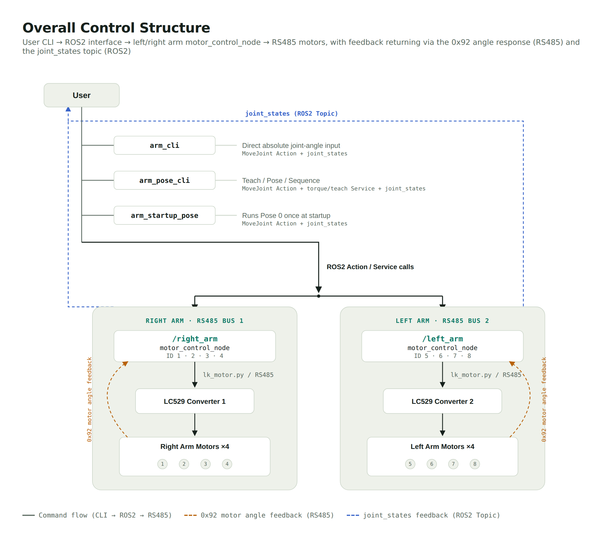

**English** | [한국어](./README.ko.md)

# 8-Axis Dual-Arm ROS2 Control

This repository provides the ROS2 Humble control stack for the iROI dual-arm robot, built from eight LK-TECH RS485 motors. It supports absolute-reference recovery, current-position HOLD, absolute joint-angle motion, Teach mode, persistent poses, and pose sequences.

> Development status: communication, model/angle reads, and individual zero checks have been verified for IDs 1–8, with four-axis Action motion verified in stages. Final simultaneous eight-motor testing on two RS485 buses, physical direction calibration, and joint-limit configuration are still pending.

## Project at a Glance

| Stage | Summary |
|---|---|
| Problem | Control eight RS485 motors with mixed reduction ratios as two arms, recover coordinates after power-up, prevent gravity sag, and reproduce saved poses. |
| Design | Separate right and left arms by namespace and RS485 bus, then layer ROS2 Topics, Services, Actions, and user CLIs above a low-level motor driver. |
| Core implementation | `reference_only`, current-position HOLD, absolute joint Action, Teach/Pose/Sequence workflows, `null` partial poses, and stable target detection. |
| Hardware result | Communication, model/angle reads, and individual zero references were checked for IDs 1–8; mixed i10/i36 operation and four-axis Action motion were verified in stages. |
| Demo | Photos and video of full dual-arm startup, Teach capture, and Pose/Sequence execution will be added after final eight-axis hardware validation. |
| Engineering decisions | Restore the reference and HOLD instead of automatically moving an assembled arm to zero; use absolute output angles rather than relative increments; declare arrival only after tolerance is met across consecutive samples. |

## Read This First

- Physically support the arm and keep an emergency power cut-off within reach during hardware tests.
- Use `start_pose:=false` for the first hardware validation and after wiring, assembly, zero-reference, or direction changes. It restores the coordinate reference and HOLDs the current position. After validation, normal operation may use `start_pose:=true` to run Pose 0 automatically.
- Teach ON disables torque. The arm can fall under gravity, so support it before enabling Teach.
- Only one process may use an RS485 port. Do not run `scan_ids`, `probe_motors`, or `check_home` on a port while `motor_control_node` is using it.
- Joint min/max limits are not configured yet. Verify direction and mechanical clearance with low speed and very small targets.

## Final Motor Topology

| Arm | Motor IDs | ROS namespace | Action endpoint | Current/expected port |
|---|---:|---|---|---|
| Right | 1, 2, 3, 4 | `/right_arm` | `/right_arm/move_to` | `/dev/ttyUSB0` |
| Left | 5, 6, 7, 8 | `/left_arm` | `/left_arm/move_to` | `/dev/ttyUSB1` expected |

IDs 1, 2, 5, and 6 are `MG4010E-i10` motors with 10:1 reduction. IDs 3, 4, 7, and 8 are `MG5010E-i36` motors with 36:1 reduction. Each arm uses a separate LC529 USB-RS485 adapter in the final setup.

## Overall Control Architecture



One `motor_control_node` owns one arm and one RS485 bus. Higher-level CLIs never send raw motor packets; they use only namespaced ROS2 interfaces.

## Hardware Configuration

Only details confirmed by the code and staged hardware checks are listed here.

| Component | Quantity | Confirmed detail | Status |
|---|---:|---|---|
| Control computer | 1 | Raspberry Pi 4, ROS2 Humble | In use |
| USB-RS485 adapter | 2 | Two LC529 adapters available, one independent bus per arm | Right `/dev/ttyUSB0`; left `/dev/ttyUSB1` expected |
| i10 motor | 4 | MG4010E-i10, IDs 1·2·5·6, ratio 10.0 | Individually checked |
| i36 motor | 4 | MG5010E-i36, IDs 3·4·7·8, ratio 36.0 | Individually checked |
| Motor power | Unconfirmed | Measured motor voltage approximately 24 V | Confirm model, rating, quantity, and distribution |
| Pose storage | 1 | Runtime user path `~/.ros/arm_poses.json` | In use |

### Detailed Wiring Diagram — To Be Added

The power supply and pin-level wiring are not finalized. The real wiring diagram will be added after the power, RS485, protection, and connector arrangements are organized. Do not use a generic example diagram as the construction reference before confirmation.

When both LC529 adapters are connected, `/dev/ttyUSB0` and `/dev/ttyUSB1` assignments can change with reboot or connection order. A persistent device-naming rule based on USB serial information should be defined before final operation.

## Quick Start

### 1. Build

The active workspace on Raspberry Pi is `~/iroi_ws`.

```bash
cd ~/iroi_ws
source /opt/ros/humble/setup.bash
colcon build --symlink-install
source install/setup.bash
```

In every new terminal:

```bash
cd ~/iroi_ws
source install/setup.bash
```

### 2. Start One Arm Without Startup Motion

Right arm, IDs 1–4:

```bash
ros2 launch motor_control_pkg single_arm_reference.launch.py \
  arm:=right serial_port:=/dev/ttyUSB0 start_pose:=false
```

Left arm, IDs 5–8:

```bash
ros2 launch motor_control_pkg single_arm_reference.launch.py \
  arm:=left serial_port:=/dev/ttyUSB0 start_pose:=false
```

When only one adapter is available and the arms are connected one at a time, both commands may use the actual adapter at `/dev/ttyUSB0`. The launch performs `reference_only` synchronization and immediately commands the measured position as a HOLD target. It does not move the arm to zero.

### 3. Verify Readiness

In a second terminal, for the right arm:

```bash
cd ~/iroi_ws
source install/setup.bash
ros2 topic echo /right_arm/joint_states --once
ros2 action list
ros2 action info /right_arm/move_to
```

Replace `right_arm` with `left_arm` for the left side. Control is ready when a fresh `joint_states` message is printed and the Action server is visible.

### 4. Start and Automatically Run Pose 0

Use this only after the safe startup, direction checks, and Pose 0 inspection are complete.

```bash
ros2 launch motor_control_pkg single_arm_reference.launch.py \
  arm:=right serial_port:=/dev/ttyUSB0 start_pose:=true
```

Startup flow:

```text
connect motors → reference-only synchronization → current-position HOLD
→ joint_states/Action ready → run Pose 0 from ~/.ros/arm_poses.json → READY
```

If every active value in Pose 0 is `null`, startup performs no motion and completes as ready.

### 5. Start Both Arms

After both adapters and all eight motors are connected, begin with startup-pose motion disabled:

```bash
ros2 launch motor_control_pkg dual_arm_reference.launch.py \
  right_port:=/dev/ttyUSB0 left_port:=/dev/ttyUSB1 start_pose:=false
```

Change to `start_pose:=true` only after both sides and Pose 0 have been validated.

## Direct Joint Control: `arm_cli`

Keep one of the launches above running. Open the CLI in another sourced terminal:

```bash
# Right arm: IDs 1,2,3,4
ros2 run motor_control_pkg arm_cli --ros-args -p mode:=right

# Left arm: IDs 5,6,7,8
ros2 run motor_control_pkg arm_cli --ros-args -p mode:=left

# Both arms: IDs 1,2,3,4,5,6,7,8
ros2 run motor_control_pkg arm_cli --ros-args -p mode:=dual
```

Enter one target per active motor followed by one speed. Units are output-axis degrees and degrees per second.

```text
# Move the right arm to [10, -5, 20, 0]° at 15°/s
arm> 10 -5 20 0 15

# Move only the right arm; HOLD the left arm at its current position
arm> 10 -5 20 0 null null null null 15

arm> status
arm> help
arm> q
```

Targets are **absolute output/joint angles** relative to the saved zero, not relative increments. If the current angle is 30° and the command is 50°, the final angle is 50° and the physical change is +20°. A `null` target is replaced with that motor's latest measured angle, so it remains in place. If all active targets for an arm are `null`, no Action is sent to that arm.

## Teaching, Saving, and Running Poses: `arm_pose_cli`

Runtime poses are stored in `~/.ros/arm_poses.json` for the Raspberry Pi user, not in the repository's example `config/poses.json`. Keep the motor launch running and start one CLI:

```bash
ros2 run motor_control_pkg arm_pose_cli --ros-args -p mode:=right
ros2 run motor_control_pkg arm_pose_cli --ros-args -p mode:=left
ros2 run motor_control_pkg arm_pose_cli --ros-args -p mode:=dual
```

Main commands:

| Command | Purpose |
|---|---|
| `status` | Show latest angles, Teach state, and state age |
| `list` / `show 0` | List poses / inspect one pose |
| `save 1 wave` | Save the latest measured active-arm state as Pose 1 |
| `teach active on` | In single-arm mode: STOP, then torque OFF |
| `teach right on` | In dual mode: enable Teach on the right arm only |
| `teach-save 0 attention` | Teach OFF + HOLD, then save the new state as Pose 0 |
| `pose 0 10` | Run Pose 0 at 10°/s |
| `sequence 0 1 2 1 0` | Run poses in order at the default speed |
| `delete 2` | Delete Pose 2; Pose 0 cannot be deleted |
| `torque active on/off` | Low-level torque control; prefer Teach for normal use |

### Recommended Teach-to-Pose-0 Workflow

Support the robot physically throughout this procedure.

```text
arm> teach active on
# Move the arm by hand into the desired pose.
arm> teach-save 0 attention
arm> show 0
arm> pose 0 10
```

`teach-save` is more than a file write. It first requests Teach OFF, waits for current-position HOLD, then waits for a newly published `joint_states` sample and saves that sample. In single-arm mode, the four active IDs are stored as numbers and the other four IDs are stored as `null`. Dual mode stores all eight.

When replaying a pose, `null` for an active motor becomes its current angle and therefore HOLDs that motor. The disconnected opposite arm is not part of a single-arm mode and is ignored.

## Coordinate and Zero Reference

The current configuration treats the saved absolute encoder reference in `zero_single_deg` as the robot joint's logical 0°. The relevant motor command frames are:

| Command | Meaning |
|---|---|
| `0x94` | Persistent single-turn absolute angle |
| `0x92` | Multi-turn motor angle for the current session |
| `0xA4` | Absolute position command in the `0x92` frame |

```text
output_angle = direction × (current_0x92 - zero_0x92) / ratio
target_0x92  = zero_0x92 + direction × target_output_angle × ratio
```

- `ratio`: 10.0 for i10; 36.0 for i36
- `direction`: sign between logical positive joint motion and motor rotation; defaults to `+1`
- `zero_encoder`, `zero_raw`: optional diagnostics; they may be `null` when firmware does not answer `0x90`
- `loop_period_deg`: 3600° for i10; 12960° for i36

Physical `direction` signs still require final calibration on the assembled robot. Test each joint with a very small target, then set the corresponding config value to `1.0` or `-1.0`.

## HOLD and Teach Safety Behavior

- After `reference_only`: read current `0x92` → `motor_on()` → command the same angle through `0xA4`
- `/torque true`: succeeds only if torque ON and current-position HOLD both succeed
- Teach ON: STOP → torque OFF
- Teach OFF: read current `0x92` → motor ON → current-position HOLD
- MoveJoint is rejected while Teach is ON or torque is OFF
- Any HOLD failure returns an error instead of reporting false success

`startup_mode=disabled` is a torque-off diagnostic state without normal reference recovery or motion readiness. Use `reference_only` for real operation.

## Goal Completion Criteria

An Action does not succeed merely because a command was transmitted. Roughly every 0.1 seconds, the node checks whether every moving motor is within **0.2°** of its target. All motors must satisfy that condition for **three consecutive checks**.

```text
check 1: every error ≤ 0.2° → stable count 1
check 2: every error ≤ 0.2° → stable count 2
check 3: every error ≤ 0.2° → motion complete
```

If any motor leaves the tolerance, the count resets to zero. This prevents a target crossing or brief encoder sample from being mistaken for a stable arrival. Homing uses the same tolerance and three-check rule with an approximately 0.05-second check interval.

## What Each File Does

| File | Role |
|---|---|
| `iroi_interfaces/action/MoveJoint.action` | Defines target/speed arrays, success/timeout result, and angle/error feedback |
| `motor_control_pkg/lk_motor.py` | Low-level LC529/RS485 packet, info, angle, torque, and position driver |
| `motor_control_pkg/motor_control_node.py` | Owns one arm bus: connection, reference/HOLD, `joint_states`, services, and MoveJoint Action |
| `motor_control_pkg/arm_cli.py` | Direct absolute-angle CLI for right, left, or dual mode |
| `motor_control_pkg/pose_manager.py` | Validates, atomically stores, reads, and deletes fixed ID 1–8 poses |
| `motor_control_pkg/arm_pose_cli.py` | User CLI for Teach, pose save/replay, and sequences |
| `motor_control_pkg/arm_startup_pose.py` | Waits for Actions and fresh states, then runs Pose 0 once |
| `motor_control_pkg/scan_ids.py` | Discovers responding IDs and models in a selected range |
| `motor_control_pkg/probe_motors.py` | Read-only `0x12/0x94/0x90/0x92` inspection for selected IDs |
| `motor_control_pkg/check_home.py` | Read-only calculation of the delta to the saved zero |
| `launch/single_arm_reference.launch.py` | Starts one selected physical arm with reference/HOLD and optional Pose 0 |
| `launch/dual_arm_reference.launch.py` | Starts both physical buses/arms and optionally runs dual Pose 0 |
| `launch/single_motor_id4_real.launch.py` | Single-ID-4 diagnostic launch; not the normal runtime |
| `config/zero_config_i10_verified.json` | ID 1–8 model, ratio, absolute-zero, and period configuration |
| `config/poses.json` | Repository example/schema; runtime poses use `~/.ros/arm_poses.json` |

Several earlier test-only launches were consolidated while moving to the current eight-motor structure.

## ROS Interfaces

Each arm namespace exposes:

| Type | Right-arm example | Purpose |
|---|---|---|
| Topic | `/right_arm/joint_states` | Current output-axis angles in radians |
| Action | `/right_arm/move_to` | Absolute output-axis angle motion |
| Service | `/right_arm/torque` | Torque OFF or torque ON + HOLD |
| Service | `/right_arm/teach` | Teach ON/OFF |
| Service | `/right_arm/sync_reference` | Restore reference without zero motion, then HOLD |
| Service | `/right_arm/set_zero` | Store the current absolute angle as a new zero |
| Service | `/right_arm/home` | Physically move to the saved zero |

Do not use `/home` as the normal startup path for an assembled arm. The standard launch uses `reference_only`.

## Read-Only Diagnostics

Stop the motor node before using the same serial port:

```bash
ros2 run motor_control_pkg scan_ids \
  --port /dev/ttyUSB0 --start 1 --end 8

ros2 run motor_control_pkg probe_motors \
  --port /dev/ttyUSB0 --ids 1 2 3 4

ros2 run motor_control_pkg check_home \
  --config ~/iroi_ws/src/motor_control_pkg/config/zero_config_i10_verified.json \
  --id 1
```

An `0x90 FAIL (timeout)` from `probe_motors` can be an expected optional-command limitation on some firmware if `0x94` and `0x92` are healthy.

## First Real-Hardware Acceptance Sequence

1. Support the robot and start only one arm with `start_pose:=false`.
2. Confirm four connections, reference synchronization, current HOLD logs, and fresh `joint_states`.
3. In `arm_cli`, command only one joint by ±1–2° and use `null` for the other three.
4. Confirm physical direction and clearance; finalize each `direction` sign.
5. Confirm Action completion occurs only after three consecutive samples within 0.2°.
6. Save a safe Pose 0 with Teach, then replay it at 5–10°/s.
7. Repeat on both sides, then test `dual_arm_reference.launch.py` with two ports.
8. Use `start_pose:=true` in normal operation only after the complete validation.

## Technology Stack

| Area | Technology |
|---|---|
| Language | Python 3 |
| Robotics middleware | ROS2 Humble, `rclpy` |
| ROS2 interfaces | Actions, Services, Topics, namespaces, launch, parameters |
| State representation | `sensor_msgs/JointState`, degree↔radian conversion |
| Hardware communication | USB-RS485, LC529, LK-TECH binary motor protocol |
| Data | JSON absolute-zero configuration and runtime pose storage |
| Concurrency | Serial/motion locks, MultiThreadedExecutor, asynchronous Actions/Services |
| Build and packaging | `colcon`, `ament_python`, `setuptools` |
| Verification | Read-only diagnostic CLIs, mock checks, staged real-motor checks |
| Version control | Git, GitHub |

## Problems Solved Directly in This Project

- Per-motor ratios and absolute-angle periods for mixed i10/i36 buses
- Conversion from persistent `0x94` and multi-turn `0x92` frames into logical output-axis coordinates, including reference recovery after power-up
- Optional `0x90` failure isolated from the required reference/state reads
- Shared current-position HOLD after startup, torque ON, and Teach OFF
- `null` means current-position hold, while an all-null arm receives no Action
- Full preflight validation before sending any dual-arm goal, preventing partial motion
- Fresh-state-only pose saving after Teach OFF/HOLD
- Stable target detection using tolerance plus consecutive samples
- Namespace and ID mapping that allow one code path to operate either one arm or both arms

## Remaining Work

- [ ] Simultaneous communication test with two LC529 adapters and IDs 1–8
- [ ] Physical `direction` calibration for every joint
- [ ] Joint min/max angle limits
- [ ] Real-hardware validation of dual Teach, Pose 0, and sequences
- [ ] Emergency-stop and communication-recovery procedure
- [ ] Production pose library

## Troubleshooting

- Missing Action: verify the matching arm launch with `ros2 action list`.
- `joint_states is stale`: check the node log and RS485 bus. The CLI refuses to move on stale data.
- Cannot open serial port: stop any other node or diagnostic process using that port.
- Missing config: verify the `zero_config:=...` argument and the installed config files.
- Pose causes no motion: use `show <ID>` and check whether every active value is `null`.
- Wrong direction: stop further motion and inspect that motor's `direction` config.
